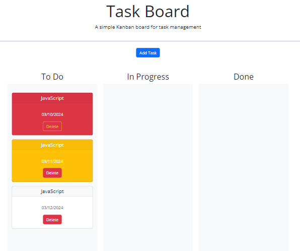

# Task board Challenge

## Description

This challege is to create a simple task board application that allows a team to manage project tasks. This project is a lot of third party APIs. I learn that Jquery function are more useful and easy to use. I learn bootstrap css property. I learn what are the correct form and modal. I learn how to put a different class element in the html that link to bootstrap. I learn how to link html to bootstrap, Jquery, Jquery UI, and Google font UI. I learn how Jquery function work in JavaScript. It is really complicate when use all of these together.

## Usage

This is the website that you can add tasks, create card, drag around change the status of the task, and delete the task card.
If the due date has past it will show in red, if the due date is today card will be yellow, and if not yet due date it will be white.

This is the link to the website: [Task Board Page](https://fonknp.github.io/Fon-05-Task-Board-Challenge/)

This is the screenshot from the website.

## Credits

Myself , my peers, my tutors, my instructor, and Xpert learning assistance.

## License

MIT License